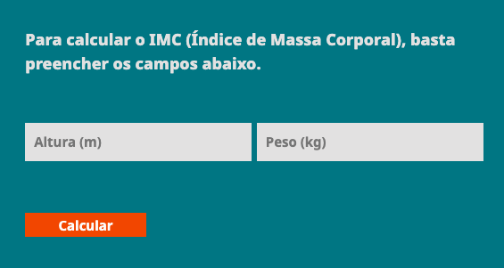

## Calculadora de imc

- O botão "Calcular" chama uma função em javascript que realiza o cálculo do imc recebendo uma altura e um peso como parametros.

## Login Gmail

- Quando se preenche os campos de e-mail e senha, e clica-se no botão "Fazer Login", há um código que verifica a validação dos dados.